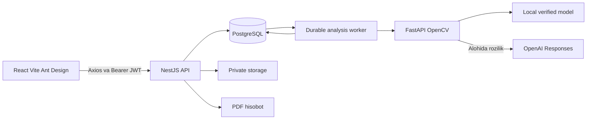

# Arxitektura

Frontend barcha requestlarni `/api/v1`dan oladi. Access token memory’da, refresh cookie HttpOnly. API egani, rozilikni, faylni va analysis holatini tekshiradi. Surat Sharp bilan orientatsiyasi to‘g‘rilanib qayta encode qilinadi. Private local/S3 adapter uni public endpointga chiqarmaydi.

Joblar PostgreSQLda transaction bilan analysisga bog‘langan; bu navbat yo‘qolishining oldini oladi. Lokal runner DBdan lease bilan ish oladi. Compose’da Redis/BullMQ navbat va alohida worker yo‘li mavjud. Yakuniy natija yozishdan oldin deletion/consent holati qayta tekshiriladi.

ML private service token ishlatadi. OpenCV sifatni o‘lchaydi. ML provayderi explicit tanlanadi; biridan ikkinchisiga yashirin fallback yo‘q. Tashqi OpenAI ishlatilsa foydalanuvchi surat yuborilishini alohida tasdiqlaydi. Local artifact yuki checksum va label schema orqali tekshiriladi.

O‘chirish avval kirishni yopadi, keyin storage/DBni retry qiladigan worker tozalaydi. Surat, PDF, maska va heatmaplar tahlil bilan birga boshqariladi. Temporary tahlil tarix ro‘yxatiga chiqmaydi va muddati tugaganda berilmaydi.
